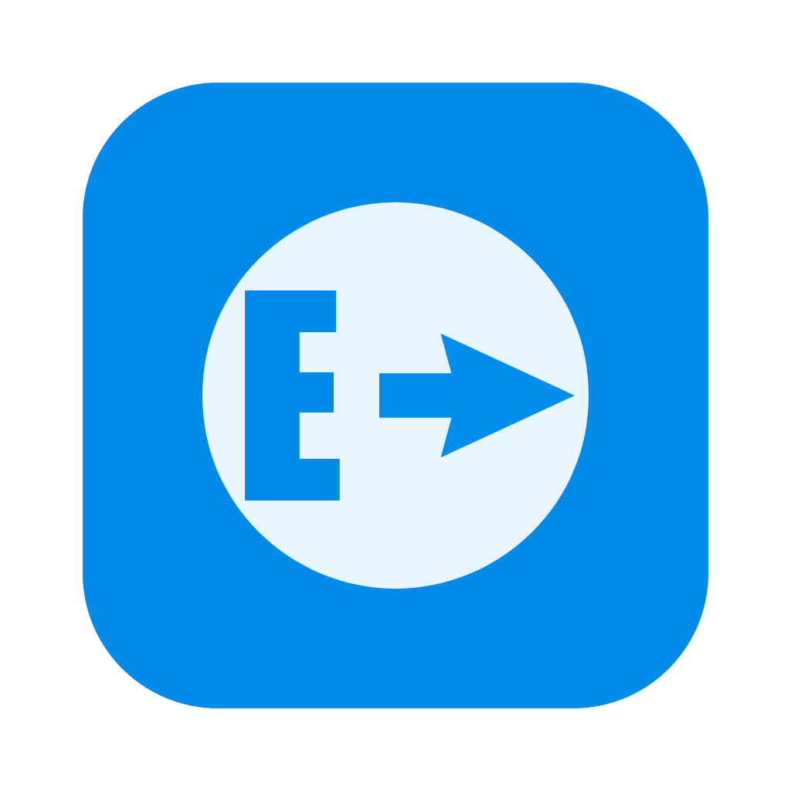

             
             <h1>EDNExport</h1>

## O que é o EDNExport?
É um projeto GUI (aplicativo baseado em gráficos) baseado em Python para exportar os dados dos arquivos delimitados do DNE.
O principal objetivo do projeto é facilitar a exportação e atualização dos dados do DNE
para arquivos SQL ou para Banco de Dados.

## O que é DNE?
É um banco de dados, oficial e exclusivo dos Correios, que contém mais de 900 mil CEP de todo o Brasil, constituído de elementos de endereçamento (descrição de logradouros, bairros, municípios, vilas, povoados) e Códigos de Endereçamento Postal - CEP. Disponível para pessoas físicas e jurídicas com ou sem contrato com os Correios.

----------

 

----------

Recursos do EDNExport:

* Exportação para arquivos SQL
    - Criação de arquivos SQL com Insert
* Exportação de atualização para arquivos SQL
    - Criação de arquivos SQL com Delete
    - Criação de arquivos SQL com Update

* Banco de Dados
    - Conexão com o BD
    - Criação de tabelas
    - Insert de dados
    - Update de dados
    - Delete de dados

* Opções
    - Alteração de Idioma
        - Nota: Para alterar o idioma verifique no menu do topo Configurações/Configurar Opções. Selecione o idioma desejado e pressione o botão Confirmar. A barra de status ira informar o idioma atual.
    - Modo Versão de Teste
        - Nota: Para alterar para a versão de teste verifique no menu do topo Configurações/Configurar Opções. ***Se a opção Versão de Teste for "Sim", será usada a base de dados modelo fornecida pelos correios que se encontra no diretório extra ou através do link [Correios](https://www.correios.com.br/enviar/marketing-direto/arquivos). Obs.: A base de dados de teste que se encontra nos correios possui bug, sugiro o uso da versão que se encontra na pasta [extra](./extra/). Padrão: "Não" para uso em com base de dados completa***
        - Nota 2: Quando o modo de teste estiver ativo mudará o sinalizador de status de vermelho para verde.
----------

## Compatibilidade

Nota: O EDNExport foi desenvolvido para multiplataforma, você pode fazer o download
dos arquivos binários para as seguintes plataformas:
* [MacOSX](./dist/MacOSX/EDNExport.zip) - MD5 (EDNExport.zip) = a157ad40e0df63c56723081872b52f59
* [Windows](./dist/Windows/ednexport.zip) - MD5 (ednexport.zip) = 184ed74fa7881dbe52202e4e5bd5fab8

Nota 2: O EDNExport foi desenvolvido para **exportar os dados para o banco de dados
_MySQL_, se você não usa o _MySQL_ como banco de dados você pode usar a exportação para
arquivos SQL**.

----------

## Começando

Para começar a usar o EDNExport, é muito simples:

**Exporta para arquivo SQL**

1. Com o EDNExport aberto clique em **Configurações** na barra de menus do topo e selecione o tipo de
Diretório Delimitado:
    - Exportar para a base de dados inicial. **Arquivos da pasta Basico/Delimitado ou Master/Delimitado. Os arquivos devem começar com LOG_.**
    - Atualizar para arquivos delimitados de atualização. **Arquivos da pasta Delta_Basico/Delimitado ou Delta_Master/Delimitado. Os arquivos devem começar com DELTA_.**
2. Depois de selecionar o diretório contendo os arquivos delimitados o EDNExport mudará o sinalizador
de status de vermelho para verde se o diretório for o correto ou mostrará uma mensagem avisando que o
diretório não possui os arquivos necessários.
3. Clique na guia **Exporta para arquivo SQL**
4. Clique no botão Exportar para gerar os arquivos SQL de exportação ou em Atualizar para gerar os 
arquivos SQL de atualização.
    - Por padrão o EDNExport cria uma pasta **arquivos_exportados** no Desktop, para alterar o caminho
    de onde os arquivos são salvos você precisa alterar o parâmetro _DIR_EXPORTADOS_ no arquivo 
    [arquivos_config.py](./src/arquivos_config.py) e gerar o seu próprio arquivo binário a partir do
    código fonte. Para mais detalhes de como gerar o seu próprio arquivo binário consulte a sessão 
    **Crie e execute a partir do código**
    - Nota: Os arquivos da pasta **arquivos_exportados** são substituídos a cada operação de exportação, se você deseja manter os arquivos anteriores os copie para outra pasta.

**Exporta para Banco de Dados**

1. Com o EDNExport aberto clique em **Configurações** na barra de menus do topo e selecione o tipo de
Diretório Delimitado:
    - Exportar para a base de dados inicial. **Arquivos da pasta Basico/Delimitado ou Master/Delimitado. Os arquivos devem começar com LOG_.**
    - Atualizar para arquivos delimitados de atualização. **Arquivos da pasta Delta_Basico/Delimitado ou Delta_Master/Delimitado. Os arquivos devem começar com DELTA_.**
2. Depois de selecionar o diretório contendo os arquivos delimitados o EDNExport mudará o sinalizador
de status de vermelho para verde se o diretório for o correto ou mostrará uma mensagem avisando que o
diretório não possui os arquivos necessários.
3. Clique em **Conexão Banco de Dados** na barra de menus do topo:
    - Adicione o endereço de seu servidor **MySQL**.
    - Adicione o seu usuário.
    - Adicione a senha para o seu usuário.
    - Adicione a base de dados que será usada para a exportação e atualização dos dados.
        - Nota: ***O usuário deve ter permissão para criar tabelas e inserir dados.***
        - Nota 2: ***É recomendado usar uma base de dados que não esteja em produção.***
4. Depois de inserir os dados de conexão com o banco de dados, clique em **Conectar** o EDNExport mudará o sinalizador de status de Conexão de vermelho para verde se as informações estiverem corretas ou mostrará uma mensagem de erro de conexão com o banco de dados.
    - Se o status de conexão for verde clique em Confirmar para continuar.
5. Clique na guia **Exporta para Banco de Dados**
6. Clique no botão Exportar para iniciar a exportação ou em Atualizar para iniciar atualização.
    - ***Atenção: A Exportação de dados remove todos os dados inseridos anteriormente***
    - Use a opção Atualizar para arquivos Delta de atualização.

----------

## Suporte

Este projeto é oferecido no estado em que se encontra, não garantimos suporte para quaisquer problemas que possam surgir. No entanto, se você deseja colaborar com o projeto você pode acessar o servidor do discord para sugerir novos recursos ou informar possíveis bugs.

* [EDNExport Discord Server](https://discord.gg/sMrhJjXAuU)
  * Lembre-se de que o servidor do Discord é mantido pela comunidade, por isso pedimos respeito a todos.

----------

## Crie e execute a partir do código

Para criar e execute a partir do código fonte verifique aqui: 
[Crie e execute a partir do código](./SOURCE.md)

----------

## Créditos

* [BaDcereal](https://github.com/BaDcereal)
  * Autor principal